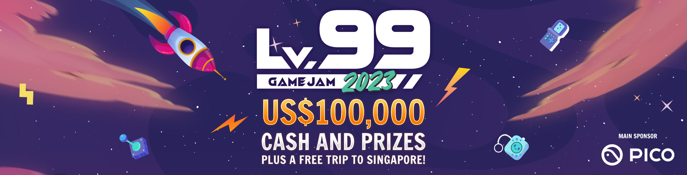
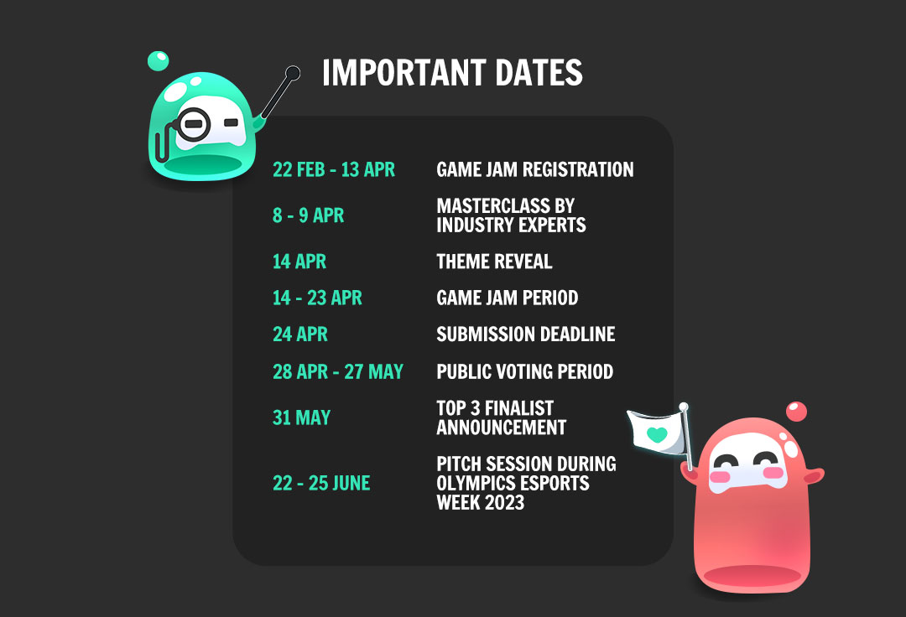

# :calendar: 23/04/2023 @ 17:59

# Gameplay

Le joueur se retrouve dans une salle et doit en sortir. Des ennemis sont disposés dans la salle. Il y a deux types d'ennemis :

- Un ennemi qui attaque le joueur à distance. Pour l'éliminer, il faut que le joueur dash sur l'ennemi.
- Un ennemi qui a un chemin défini dans la salle. Au contact de cet ennemi, un QTE se déclenche, le joueur doit le réussir pour éliminer l'ennemi.

Le joueur dispose d'une barre de *focus* qu'il peut recharger en maintenant `Espace`, mais en faisant ça il devient immobile.
Le joueur peut également se déplacer avec les touches `ZQSD` et effectuer un dash avec `Shift` en direction du pointeur de la souris, mais cela consomme une partie de la barre de focus.

Si le joueur se fait toucher, il perd une partie de la barre de focus. Si la barre de focus tombe à 0, la partie prend fin.
